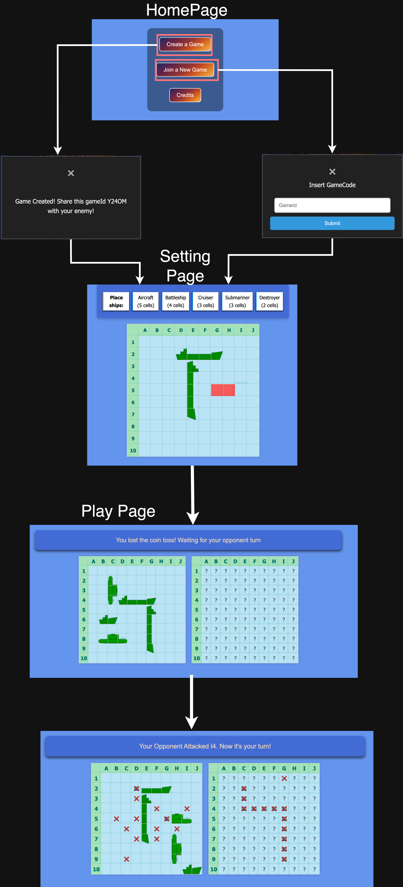

# BattleShip Web Application

BattleShip is a simple web application developed as part of my portfolio, featuring a frontend implemented in React JS and a backend in Java using the Spring framework. This app allows two players to challenge each other in a game of naval battle. The user interface consists of three main pages:

## Pages

### HomePage

- This page offers the option to start a new game or join an existing one. 
- Upon creating a new game, a game ID is provided, which can be shared with another player to allow them to join. 
- The game begins as soon as both players are connected to the same game.

### SettingPage

- Here, players must place their ships on the game grid, following the instructions displayed in a message box above the grid. 
- Players are required to select a defined number of adjacent cells, either horizontally or vertically. 
- Failure to comply with these conditions will result in an error message. 
- After all ships are positioned, the game moves to the next phase.

### PlayPage

- In the gameplay page, the player’s own ships are visible on the left, while the opponent’s grid is on the right. 
- Players attack by clicking on cells in the opponent's grid, trying to hit and sink all the enemy ships. 
- The game ends when all of one player's ships have been destroyed.

